## docwise — RAGドキュメント検索チャットアプリ

- `PDF`と`画像`をアップロードし、自然言語で質問すると関連箇所をベクトル検索して回答する`RAG`アプリ
- Gemini 2.5 Flashによるストリーミング応答、Adaptive RAG（3段階クエリ分類）+ Agentic RAG（エージェント自律検索）に対応。
- 技術スタックはReact 19 + Mastra + pgvectorなど（下で詳しく記述）

---

## デモ

### Adaptive RAG: 質問の複雑さで検索戦略を自動切替

| simple（検索スキップ） | moderate（ハイブリッド検索1回） |
|---|---|
| 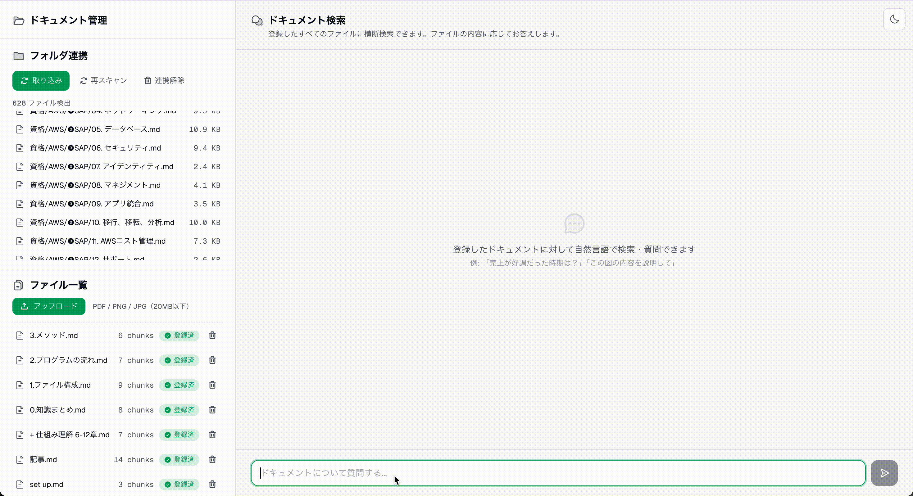 | 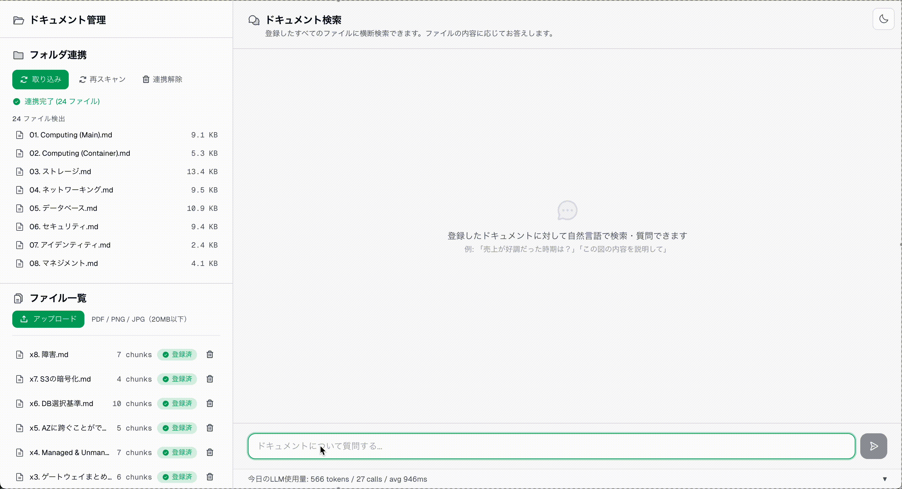 |

### Agentic RAG: エージェントが検索ツールを自律選択

| complex質問 → ツール選択・ステップ可視化 |
|---|
|  |

### ドキュメント取り込み

| PDF アップロード | 画像アップロード | フォルダ連携 |
|---|---|---|
| 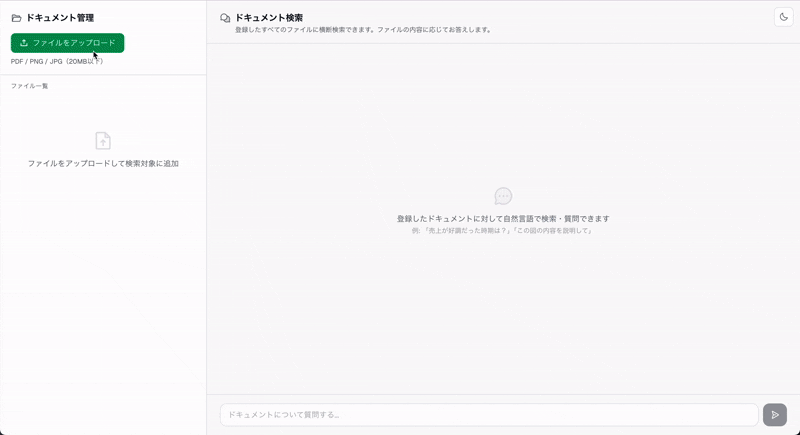 | 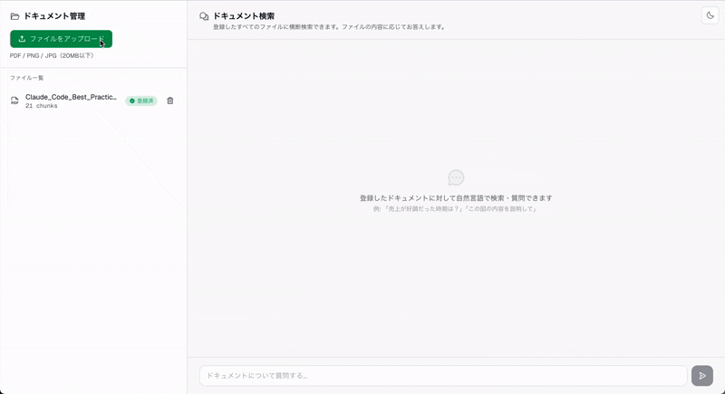 |  |

### マルチモーダル RAG

| 画像グラフの質問 | 動物画像の質問 |
|---|---|
| 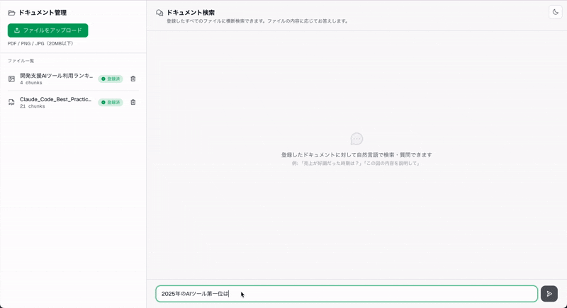 | 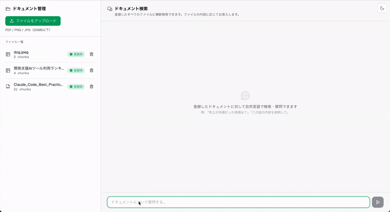 |

### Usage

| Token使用量 |
|---|
| 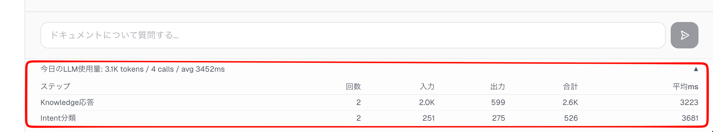 |

---

## 主な機能

- **ストリーミング応答**
    - AI SDKの`streamText` + `toUIMessageStreamResponse()`を使用
- **Adaptive RAG（3段階クエリ分類）**
    - Geminiで質問を以下のように分類し、複雑さに応じて検索戦略を動的に切り替える
      - `simple`: LLM直答（検索コストなし）
      - `moderate`: ハイブリッド検索を1回行う
      - `complex`: Agentic RAGに任せる
- **Agentic RAG（エージェント自律検索）**
    - complex判定時、エージェントが3つの検索ツール以下のツールを自律的に選択・複数回実行
      - keywordSearch
      - semanticSearch
      - chunkDeepRead）
    - `streamText` + `stopWhen: stepCountIs(3)` で最大3ステップの検索を実行し、UI上で検索プロセスをリアルタイム可視化
- **ハイブリッド検索（moderate ルート）**
    - tsvector全文検索（`ts_rank`）とベクトル類似度検索を`Promise.all`で並列実行し、結果をマージ・重複排除
- **スコア閾値フィルタリング**
    - ベクトル検索に`minScore: 0.3`を設定し、無関係なチャンクの混入を防止
- **マルチモーダルRAG**
    - 画像アップロード時に`GeminiVision`で内容をテキスト化し、元画像も検索ヒット時にLLMに渡す。索引と参照資料の役割を分離
- **PDFクレンジング**
    - pdf-parseで抽出したテキストをGeminiで整形（OCRノイズ除去 + Markdown変換）してからチャンキング
- **非同期インデックス登録**
    - アップロード即レスポンス + jobIdポーリングで進捗監視。バックグラウンドでEmbedding → pgvector保存
- **トークン使用量トラッキング**
    - 全LLM呼び出しのトークン数・レイテンシをテーブルに非同期記録および当日のステップ別集計を返し、チャット画面下部にリアルタイム表示

---

## アーキテクチャ

### 質問応答フロー（Adaptive RAG + Agentic RAG）

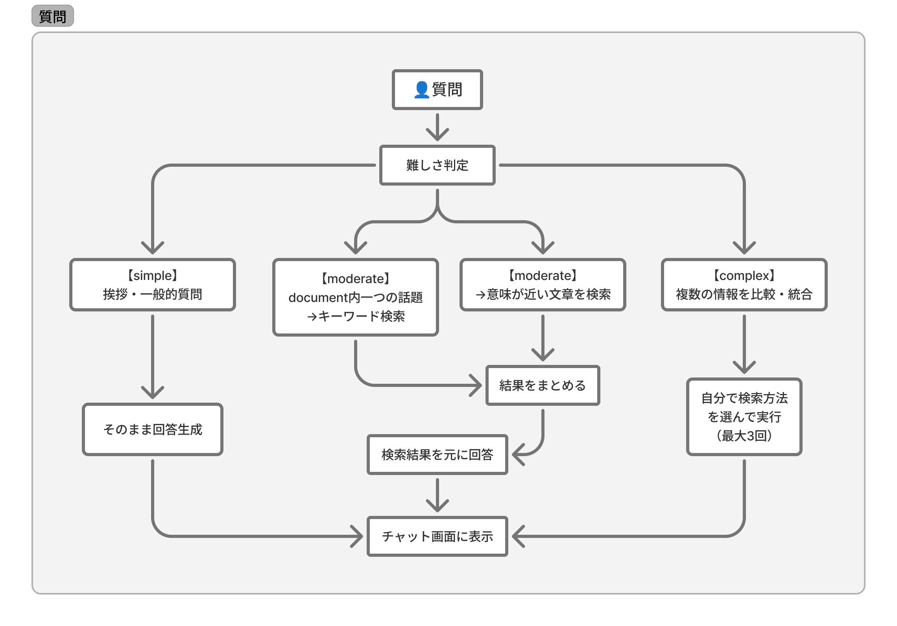

<details>
<summary>詳細フロー図</summary>

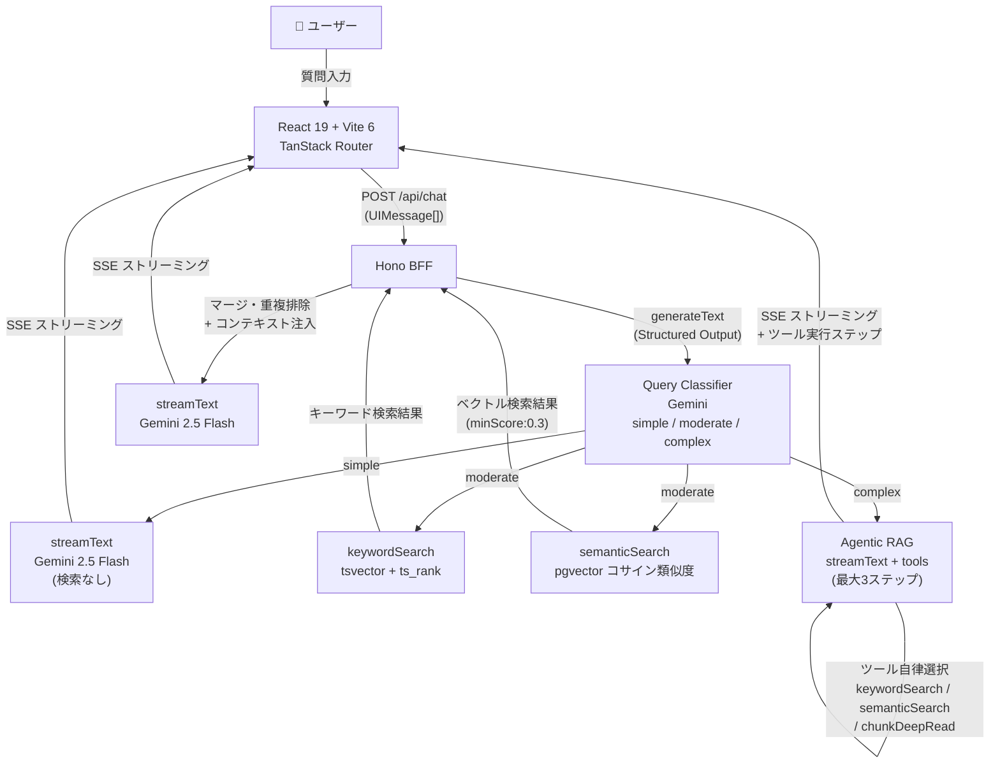

</details>

### アップロードフロー

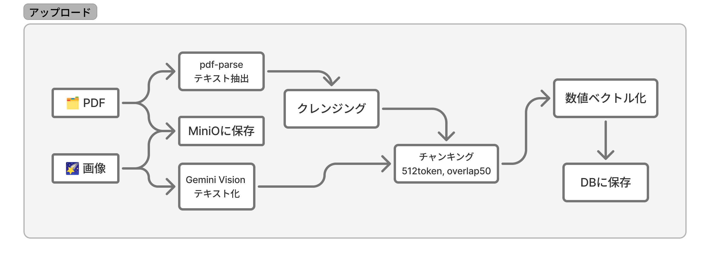

<details>
<summary>PDFアップロード詳細フロー図</summary>

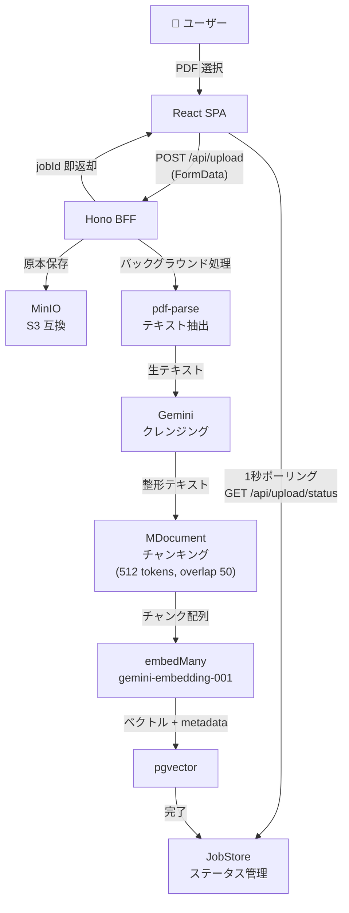

</details>


<details>
<summary>画像アップロード詳細フロー図</summary>

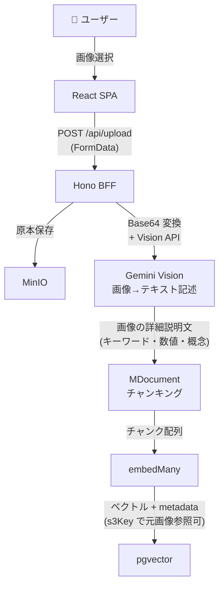

</details>


### フォルダ連携フロー

<details>
<summary>全体の流れ</summary>

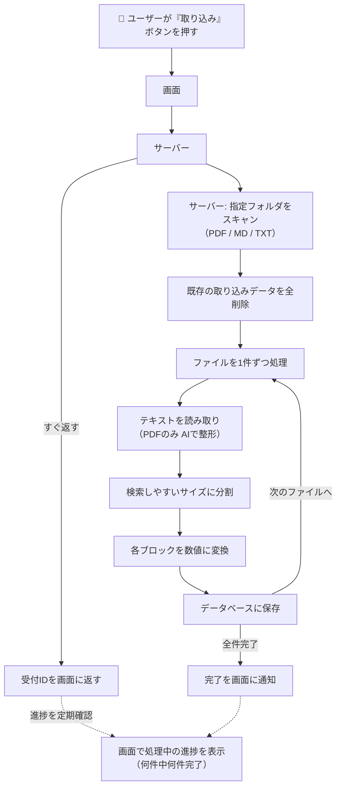

</details>

<details>
<summary>詳細の流れ</summary>

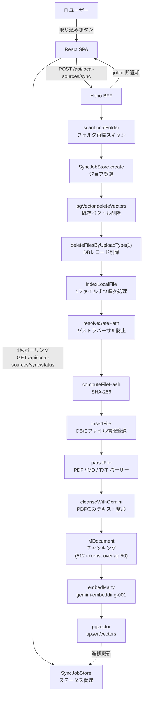

</details>

### 技術スタック

| レイヤー | 技術 | バージョン | 役割 |
|---------|------|----------|------|
| Frontend | React / Vite / TanStack Router | 19 / 6 / 1.168+ | SPA・型安全ルーティング |
| Frontend | Tailwind CSS | v4 | OKLCH ダークモード対応 |
| Frontend | @ai-sdk/react | 3 | `useChat` フックでストリーミング受信 |
| BFF | Hono / @hono/zod-validator | 4.12 / 0.7 | API ルーティング・入力バリデーション |
| AI | Mastra (@mastra/core, @mastra/rag, @mastra/pg) | 1.22+ / 2.1+ / 1.8+ | RAG パイプライン・ベクトルストア操作 |
| AI | AI SDK (ai) / @ai-sdk/google | 6 / 3 | LLM 統合・ストリーミング・Embedding |
| LLM | Gemini 2.5 Flash | — | テキスト生成・Vision・Intent 分類 |
| Embedding | gemini-embedding-001 | — | テキスト → ベクトル変換 |
| Vector DB | PostgreSQL + pgvector | pg16 | ベクトル格納・コサイン類似度検索 |
| Storage | MinIO（S3 互換） | — | PDF / 画像の原本保存 |
| Monorepo | pnpm workspace | — | 共有パッケージ管理 |
| Infra | Docker Compose | — | 全サービスのコンテナ化 |

---

## 技術選定

- Mastra
  - Chainの抽象化が深い`LangChain.js`より追いやすく、typescriptとの親和性も良い
  - AI SDKの薄いラッパーで、`embed()` → `vectorStore.query()` → `streamText()` の各ステップが明示的に見える
  - RAGの検索精度改善には各ステップを自分で制御できることが必須だったため、薄い抽象化のMastraを選んだ
- Hono
  - `zValidator` で Zod バリデーション結果が型安全に取得できる
  - BFFとして「フロントエンドのためのAPI変換層」に特化した軽量フレームワークが適する
  - `zValidator` で Zod バリデーション結果が型安全に取得でき、AI SDKの `toUIMessageStreamResponse()` が返すWeb標準Responseをそのまま返せる
- react
  - SSR / SSG は不要で、SPA で十分。Next.js を入れると App Router の Server Components / Client Components の境界管理が認知負荷になる。
  - BFF パターンで API 層を分離しているため、Next.js の API Routes も不要。
- PostgreSQL
  - 専用ベクトルDBを別途用意する必要がなく、SQLで（`WHERE fileId = ?` でメタデータフィルタ、ベクトル削除も可能

---

## 工夫した点

- **Adaptive RAG: 3段階クエリ分類 + 動的ルーティング**
  - 質問を分類し、simpleではLLM直答（コスト0）、moderateではハイブリッド検索1回、complexではエージェントが自律的に検索戦略を選択。`minScore: 0.3`で無関係チャンクを除外した。
- **画像RAGのデュアルフェーズ設計**
  - インデックス時にVisionでテキスト記述を生成して検索用索引にし、ヒット時にはS3から元画像を取得してLLMに渡す。索引と参照資料の役割を分離した。
- **PDFクレンジング**
  - pdf-parseの生テキストをGeminiで整形（OCRノイズ除去 + Markdown変換）してからチャンキング。情報量は一切削らないルールを明示した。
- **Agentic RAG: エージェント自律検索 + ステップ可視化**
  - AI SDKの`tool()`で3つの検索ツールを定義し、`streamText`の`tools`オプションで渡す。エージェントが質問に応じてツールを選択・複数回実行し、検索プロセスをUI上でリアルタイム表示する。
- **neverthrowによるパイプライン設計**
  - インデックス登録の7ステップを`ResultAsync.andThen()`で連鎖し、try-catchゼロでエラーパスを型レベルで強制した。
- **Embedding次元数の意図的な削減**
  - デフォルト3072次元を1536に指定し、精度を維持しつつストレージとクエリ速度を最適化した。
- **画像取得失敗時のgraceful degradation**
  - S3からの画像取得が失敗してもテキストチャンクだけで回答を生成。外部サービスの部分障害でも応答を止めない設計
- **LLM使用量の非同期記録とステップ別可視化**
  - `recordUsage()`は`void`で即保存し、ステップ名で集計することで、どの処理がトークン・レイテンシのボトルネックかを特定できる

---

## 苦労した点

- **チャンキング・スコア閾値のチューニング**
  - チャンクサイズ256/512/1024、overlap有無、スコア閾値0.1〜0.5を実PDFで検証し、精度と再現率のバランスで最適値を決定
- **Gemini APIレートリミット**
  - 連続アップロードで429が頻発。429/RESOURCE_EXHAUSTEDのみリトライし認証エラー等は即スローする`withRetry()`を指数バックオフで実装
- **AI SDK v6のTool型**
  - `tool()`の引数が`parameters`から`inputSchema`に変更されていた。ドキュメントに記載がなく、`.d.ts`の`FlexibleSchema<INPUT>`型定義を追って判明。Zodの`.default()`も型推論と相性が悪く、`.optional()` + ランタイムデフォルト値に変更

---

## 今後の展望

このアプリは以下のように改善すべき点があるかと思っている。

### まずやった方がいいかも

- テスト追加
- セマンティックチャンキング
- 認証機能でユーザーごとの会話履歴・ファイル分離
  - JWT / OAuth2でユーザーごとの会話履歴・ファイル分離

### 機能追加

- **ローカルフォルダ差分同期**
  - 現在は全削除→再取り込み方式。content_hash（SHA-256）を使った差分検出で、変更ファイルのみ再インデックスする仕組みを構築

### 設計

- **3層メモリ設計** (sessions、messages、memories)
  - 会話履歴の永続化が必要になったタイミングで検討
- **コンテキスト予算管理**
  - クラスか何かを作成し、トークン配分を明示
- **トークン使用量の異常検知**
  - LLM呼び出しの記録したものに関して、セッションあたりの閾値超過をアラートする仕組み
- **Reranking**
  - ハイブリッド検索の結果を Cross-Encoder で再スコアリングし、検索精度を向上
- **マルチエージェント構成**
  - タスクの多様化対応


---

## セットアップ

### 前提条件

- Docker
- Google AI APIキー（Gemini用）
- Node.js 22以上
- pnpm 9以上

### 起動

```bash
cp .env.local.example .env.local
# .env.local の GOOGLE_GENERATIVE_AI_API_KEY を変更

# DB + MinIO のみ起動
docker compose up postgres minio -d

pnpm install

# BFF + Web を起動
pnpm dev
```

その後、http://localhost:5173 でアクセスする。

### 環境変数

| 変数名 | 説明 | 取得先 |
|--------|------|--------|
| `GOOGLE_GENERATIVE_AI_API_KEY` | Gemini API キー | [Google AI Studio](https://aistudio.google.com/) |
| `POSTGRES_CONNECTION_STRING` | PostgreSQL 接続文字列 | docker-compose.yml 参照 |
| `S3_ENDPOINT` | MinIO エンドポイント | docker-compose.yml 参照 |
| `S3_BUCKET` | S3 バケット名 | デフォルト: `rag-documents` |
| `S3_ACCESS_KEY` / `S3_SECRET_KEY` | MinIO 認証情報 | デフォルト: `minioadmin` |

---

## ディレクトリ構成

```
docwise/
├── apps/
│   ├── bff/                  # Hono BFF
│   │   └── src/
│   │       ├── index.ts              # エントリポイント
│   │       └── routes/
│   │           ├── chat.ts           # チャット API
│   │           ├── upload.ts         # ファイルアップロード
│   │           ├── upload-status.ts  # ジョブ進捗ポーリング
│   │           ├── files.ts          # ファイル一覧・削除
│   │           ├── local-sources.ts  # フォルダ連携 API
│   │           └── usage.ts          # トークン使用量 API
│   └── web/                  # React SPA
│       └── src/
│           ├── components/   # UI コンポーネント
│           │   └── ui/       # 汎用 UI パーツ
│           ├── routes/       # TanStack Router ページ
│           └── lib/          # API クライアント・ユーティリティ
├── lib/                      # バックエンド共有ロジック
│   ├── mastra/               # Mastra 初期化・ベクトルストア
│   │   ├── index.ts          # pgvector初期化
│   │   ├── agent.ts          # Agentic RAGエージェント設定
│   │   └── tools/            # エージェント検索ツール
│   │       ├── keyword-search.ts   # tsvectorキーワード検索
│   │       ├── semantic-search.ts  # ベクトル類似度検索
│   │       └── chunk-deep-read.ts  # チャンク前後コンテキスト取得
│   ├── parsers/              # ファイルパーサー
│   │   ├── pdf.ts            # PDFテキスト抽出
│   │   ├── md.ts             # Markdownパーサー
│   │   └── txt.ts            # テキストファイルパーサー
│   ├── prompts/              # システムプロンプト群
│   ├── indexing.ts           # インデックスパイプライン
│   ├── local-indexing.ts     # ローカルファイルインデックス
│   ├── local-source.ts       # フォルダスキャン・パス検証
│   ├── cleansing.ts          # LLM テキストクレンジング
│   ├── query-classifier.ts   # クエリ複雑度分類
│   ├── file-store.ts         # ファイルメタデータ管理
│   ├── s3.ts                 # MinIO 操作
│   ├── retry.ts              # 指数バックオフ
│   ├── job-store.ts          # アップロードジョブ状態管理
│   ├── sync-job-store.ts     # フォルダ連携ジョブ状態管理
│   ├── usage-store.ts        # トークン使用量記録・集計
│   ├── errors.ts             # エラー型定義
│   └── env.ts                # 環境変数バリデーション
├── packages/
│   └── shared/               # BFF ↔ Web 共有
│       └── src/
│           ├── schemas.ts    # Zod スキーマ
│           ├── types.ts      # 共通型定義
│           └── constants.ts  # 定数
├── docker-compose.yml
├── Dockerfile
├── tsconfig.base.json
└── pnpm-workspace.yaml
```